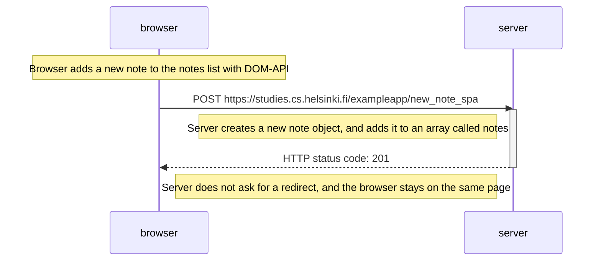

```mermaid
  sequenceDiagram
    participant browser
    participant server

    Note over browser: Browser adds a new note to the notes list with DOM-API

    browser->>server: POST https://studies.cs.helsinki.fi/exampleapp/new_note_spa
    activate server

    Note left of server: Server creates a new note object, and adds it to an array called notes

    server-->>browser: HTTP status code: 201
    deactivate server

    Note right of browser: Server does not ask for a redirect, and the browser stays on the same page
```